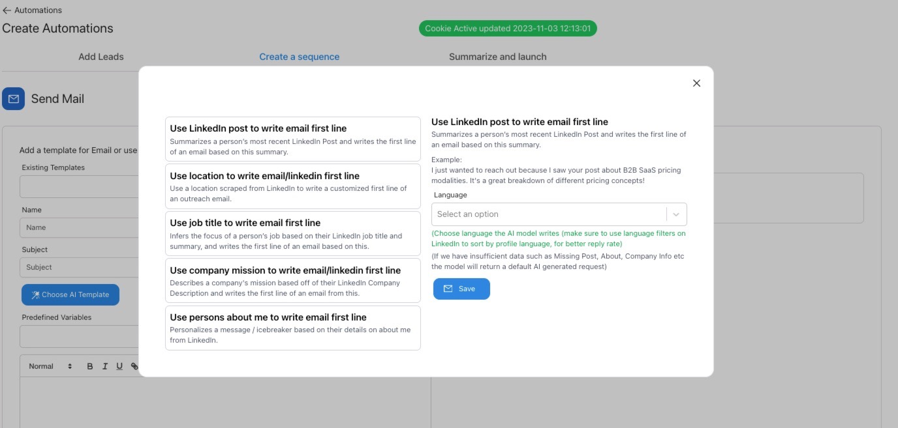

# AI email personalization

Demand is driving true AI personalization to each prospect as the first SaaS platform in the industry changing how outbound is done.

We can use multiple variations for personalization such as:
- Latest LinkedIn Post (Person)
- Job Title (Person)
- Location (Person)
- Company Mission (Company)
- About me from LinkedIn (Person)

This is just the start we are adding way more to enable true AI personalization into Demand.

You can also choose to personalize in different languages such as:
- English
- German
- French
- Spanish
- Portugese
- Danish
- Norwegian
- Dutch
- Swedish
- Romanian
- Hebrew
- and more are coming
