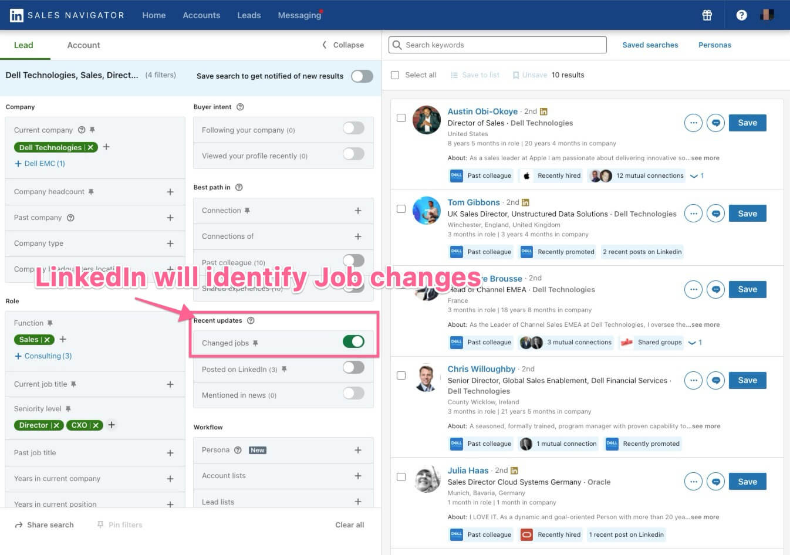
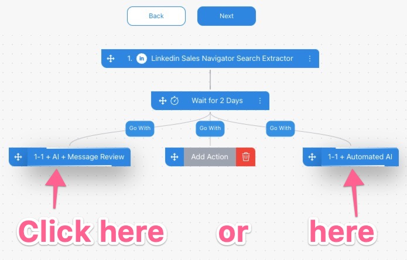

# Job Change

Build an automation on Demand is easy and it enables you to do LinkedIn, Email or both in one campaign.
We see that multi touch, LinkedIn automation using AI generated higher returns to customers.
## Head to LinkedIn Sales Navigator

Here is the basics on how to create an automation simply head to [Demand by clicking here](https://app.usedemand.com/automation/create).

Next choose a starting point where the data for your campaign is coming from we import if for you if you Choose 
- LinkedIn starting points, 
- Website visitors it well use LinkedIn sales navigator to prospect when company visiting your website is identified.)
- From my leads is CSV import or existing leads.
- Templates if you like inspiration

Here is a Video showcasing it:

## How to add AI to my Automation

If you wish to use AI to write messages, emails and connection request you need 

When selecting the two options you can learn what they mean right here:
- 1-1 + AI + Message Review simply means you get to review/edit before sending and once you hit send all steps are automated for the prospect from that point.
- 1-1 + Automated AI - You got full trust in AI doing all the writing for the parts you select AI to write and it will automatically send all steps once you start the automation.

## Adding outreach steps

After you defined where the data comes from and if you wish to use AI or regular automation you can now design your automation. You have the following options.

- LinkedIn Connection Request
- LinkedIn Message Sender
- LinkedIn Withdraw Request
- LinkedIn When Connected (wait to next step to connection is accepted)
- LinkedIn Auto Endorse
- LinkedIn Auto Visit
- Send Email

## Composing Messages

The composer is easy to use and give you a quick overview of what the AI functions has to offer and how they work.

Once you add all steps all you need to do is to hit start and you are good to go. 

Rinse and repeat! 🎉🎉🎉 in the next step you will see video walkthrough of automations.

