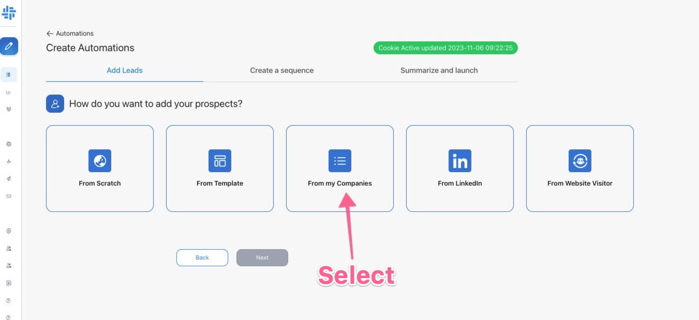

# Raised Funds on Crunchbase

If a company secures funding, it's a sign they're ready to grow. Your solution aligns perfectly with their goals and budget.

But, how can you efficiently target recently funded companies? In this guide, you'll access 3 workflow templates to pinpoint and engage these prospects seamlessly!

## Step #1: Find interesting funding on Crunchbase
Currently, there are around 7 fundraising announces on Cruchbase each day:

Next step: Scrape Crunchbase's recent funding events with [Piloterr](https://Piloterr.com/)

Once you setup an account you set it to daily scan and sync to Google Sheets making it easy to capture new companies on a daily bases.

## Step #2: Zapier to Demand Automation

Once you are done you need to go to Demand under integration and create a webhook to get the webhook URL for your automation which will design now.

Step 1 is to build an automation with starting point my companies:

