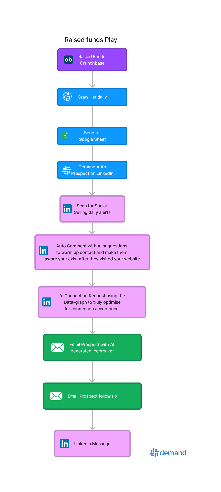
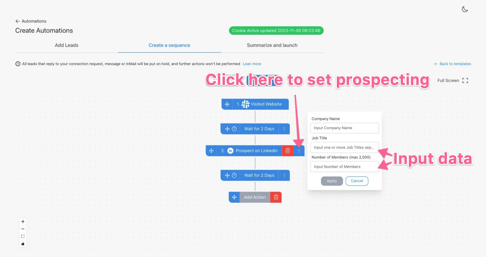

# Raised Funds on Crunchbase

If a company secures funding, it's a sign they're ready to grow. Your solution aligns perfectly with their goals and budget.

But, how can you efficiently target recently funded companies? In this guide, you'll access 3 workflow templates to pinpoint and engage these prospects seamlessly!

## Step #1: Find interesting funding on Crunchbase
Currently, there are around 7 fundraising announces on Cruchbase each day:

Next step: Scrape Crunchbase's recent funding events with [Piloterr](https://Piloterr.com/)

Once you setup an account you set it to daily scan and sync to Google Sheets making it easy to capture new companies on a daily bases.

## Step #2: Zapier to Demand Automation

Once you are done you need to go to Demand under integration and create a webhook to get the webhook URL for your automation which will design now.

Step 1 is to build an automation with starting point my companies:

Next select prospect from LinkedIn, Once you click there you will see options to start building your Automation.

Keep in mind Job title is comma seperated so you can put in something like:
- VP Sales, Director of Sales, VP Marketing etc

in the line to target multiple titles at once.

Number of Members is the amount or prospect from the visiting company.

After this step Demand will automatically after an identified visit go to LinkedIn Sales Navigator and prospect the visitor.
It will return
- LinkedIn profile link
- Data of the person used for AI
- Email
- Enrich the technology used with Techtracker

Next add your actions from Connection Request, LinkedIn message and emails.

After that you finish designing your campaign connect Zapier, turn on Piloterr and let it run automatically and now you start to build connection and relations with companies that just finished fundraising.

To set webhooks from Zapier to Demand find the guide here [Webhook guide](https://support.usedemand.com/en/articles/8436929-webhooks/)
