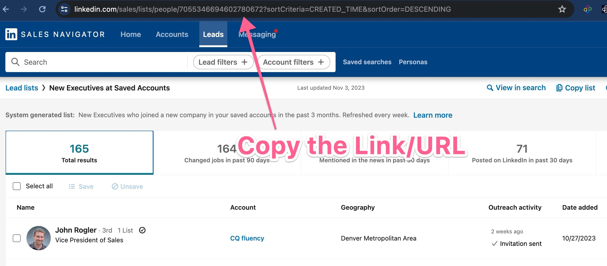
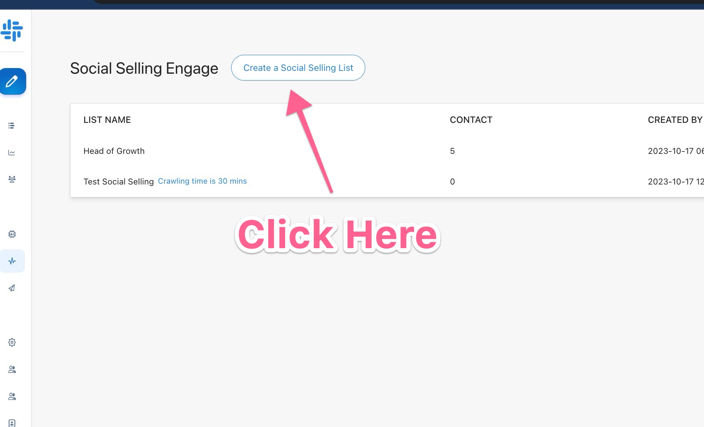
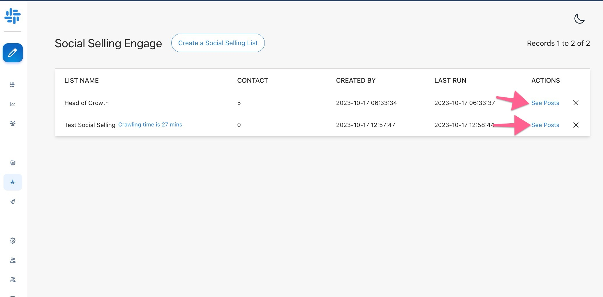

# Start with Social Selling

Social Selling is the corner stone of opening up new opportunities. Imagine what happens when potential customers start knowing you and respecting you? They take that meeting!

Okay here is how it works:

Go to LinkedIn Sales navigator create a lead list and save Customers, Dream Customers or targeted customers into a list.

Next 

Next go to Social Selling on  [Demand by clicking here](https://app.usedemand.com/social-selling).

and click here after:

then finally after adding Name for the campaign and URL hit Start social selling.

Then wait for 1 hour to the crawlers to do the magic and hit "see post"

After than read next article on what is happening next.
