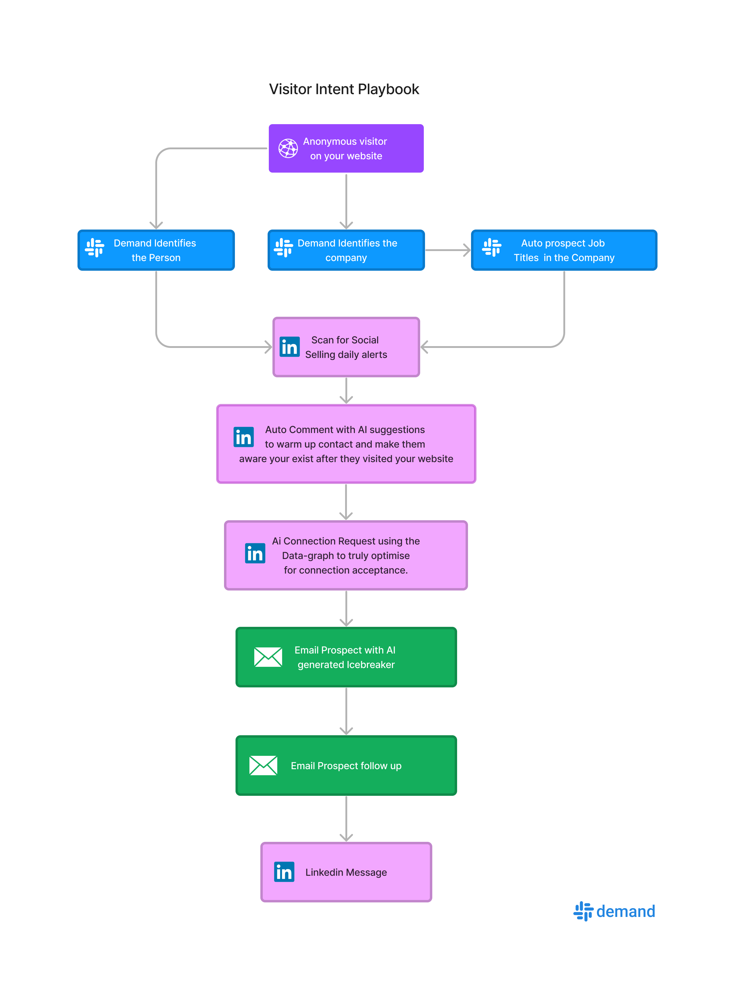
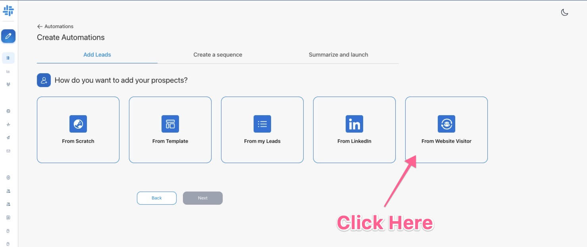
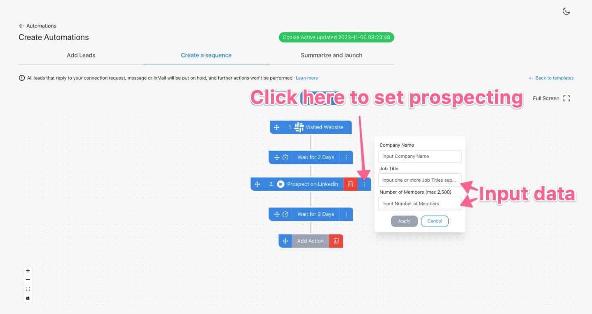
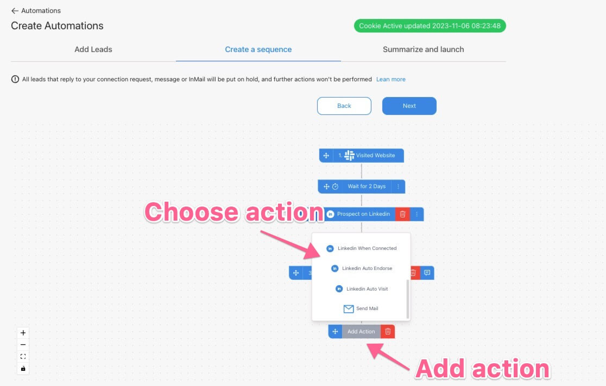
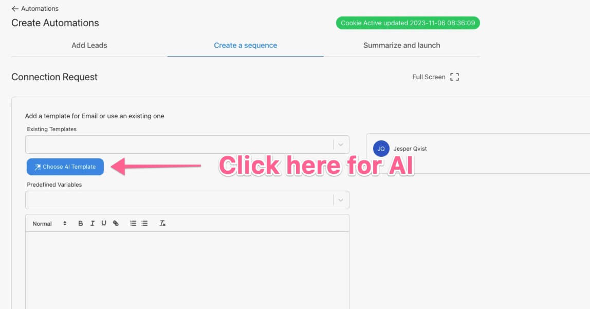
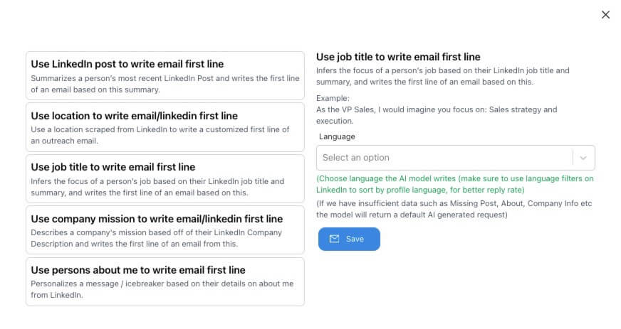

# Visited Landing Page
Driving traffic to your website without conversions is like having a store full of people, but none is actually buying from you. This is 100% automated once setup.

So, how to turn this frustrating experience into new business opportunities?

In this guide, you’ll get 3 workflow templates that will help you identify your website visitors & add them straight to your Demand campaign so that you can turn your traffic into $$$!

## 3-step workflow to target companies that visited your website

Below it will show how your campaign will look like all you need to ensure is that you have an account with [Demand](https://app.useemand.com) and have the [website visitor tracking code installed](https://app.usedemand.com).
After the overview you will find the full step by step guide:

## Step 1 Ensure Demand Visitor Tracking is installed

You need to ensure the tracking code is installed and fires up on your website as mentioned above. Once that is done you are good to start.

Demand is your secret weapon for identifying qualified leads that have visited your website.

It's like having a sharp-eyed sales associate in your digital store, notifying you about potential customers based on company size, industry, and pages visited.

Once you have confirmed you are tracking visitors in your account either People or Companies you can start.

## Step 2 Build an Automation in Demand

Start by heading over to [Automations in Demand](https://app.useemand.com/automation/create/) as shown here:

**After choose the Filter in source to choose the landing page and set url such as /pricing in the field.**

Once you click there you will see options to start building your Automation.

Keep in mind Job title is comma seperated so you can put in somehting like:
- VP Sales, Director of Sales, VP Marketing etc

in the line to target multiple titles at once.

Number of Members is the amount or prospect from the visiting company.

After this step Demand will automatically after an identified visit go to LinkedIn Sales Navigator and prospect the visitor.
It will return
- LinkedIn profile link
- Data of the person used for AI
- Email
- Enrich the technology used with Techtracker

Next add your actions from Connection Request, LinkedIn message and emails.

BONUS use AI in all requests when building the outreach:

Next choose the AI model you like Demand to use, to personlize every single message

next choose the AI type you like:

## Step 3 Start the Automation

Once you set all your messaging and templates you simply hit start and it will run 24/7. No need for thirdparty integrations or complex setup Demand is easy and works out of the box!
