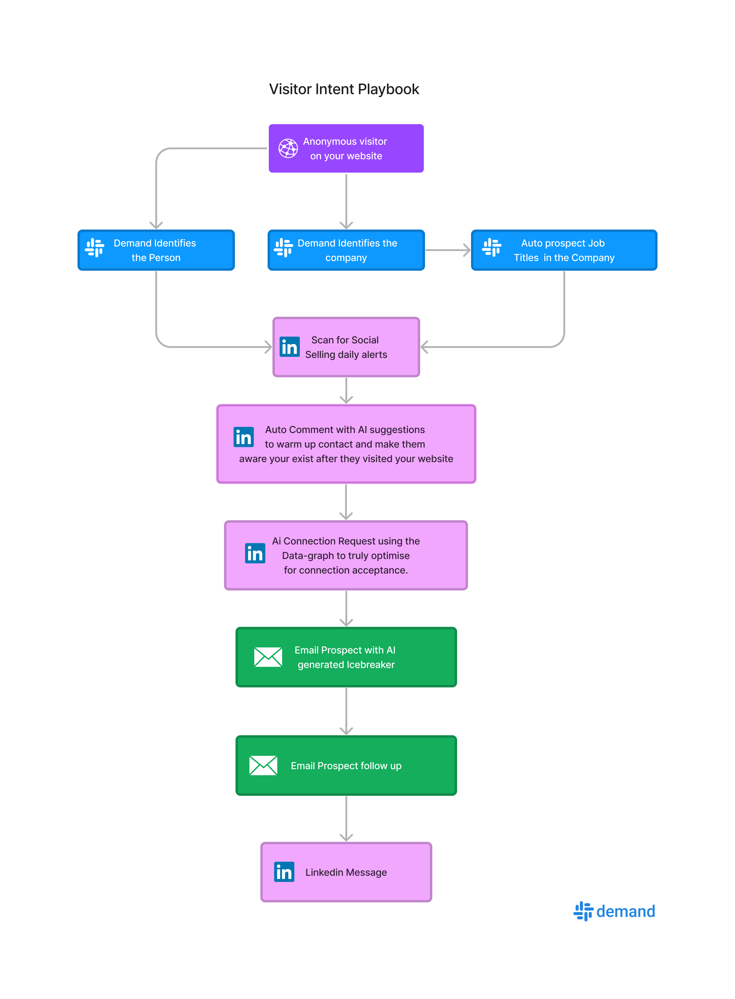

# Website Visitor Intent
Driving traffic to your website without conversions is like having a store full of people, but none is actually buying from you. This is 100% automated once setup.

So, how to turn this frustrating experience into new business opportunities?

In this guide, you’ll get 3 workflow templates that will help you identify your website visitors & add them straight to your Demand campaign so that you can turn your traffic into $$$!

## 5-step workflow to target companies that visited your website

Below it will show how your campaign will look like all you need to ensure is that you have an account with [Demand](https://app.useemand.com) and have the [website visitor tracking code installed](https://app.usedemand.com).
After the overview you will find the full step by step guide:

